# Autonomous 3D Path Planning and Adaptive Return Navigation for UAVs

This ROS2 package provides a sophisticated high-level 3D path planning and navigation system for Unmanned Aerial Vehicles (UAVs). It is engineered to function reliably using pose data from external localization modules, enabling robust autonomous operation, particularly in environments where GPS is unavailable or unreliable.

## 📖 Table of Contents
- [Autonomous 3D Path Planning and Adaptive Return Navigation for UAVs](#autonomous-3d-path-planning-and-adaptive-return-navigation-for-uavs)
  - [📖 Table of Contents](#-table-of-contents)
  - [📜 Project Abstract](#-project-abstract)
  - [🎯 Project Goals](#-project-goals)
  - [✨ Key Features](#-key-features)
  - [🤖 System Architecture](#-system-architecture)
    - [Architectural Overview](#architectural-overview)
    - [Node Descriptions](#node-descriptions)
    - [Core Logic and Algorithms](#core-logic-and-algorithms)
      - [The A* Algorithm: A Deep Dive](#the-a-algorithm-a-deep-dive)
  - [📈 RViz Simulation: Dynamic Path Planning](#-rviz-simulation-dynamic-path-planning)
    - [Dynamic Obstacle Avoidance](#dynamic-obstacle-avoidance)
    - [Complex Obstacle Avoidance Scenarios](#complex-obstacle-avoidance-scenarios)
    - [RViz Visualization](#rviz-visualization)
  - [🌍 Gazebo Simulation: Static World Navigation](#-gazebo-simulation-static-world-navigation)
    - [Gazebo World](#gazebo-world)
    - [Gazebo Drone](#gazebo-drone)
  - [🛠️ Code Implementation Highlights](#️-code-implementation-highlights)
    - [A* Planner Implementation](#a-planner-implementation)
    - [Path Follower Implementation](#path-follower-implementation)
  - [⚙️ Setup and Installation](#️-setup-and-installation)
  - [🎮 How to Run the Simulations](#-how-to-run-the-simulations)
  - [📊 Detailed Execution Logs](#-detailed-execution-logs)
    - [RViz Simulation Log](#rviz-simulation-log)
    - [ROS2 Topic Analysis](#ros2-topic-analysis)
    - [Gazebo Simulation Log](#gazebo-simulation-log)
  - [🖼️ Visualizations](#️-visualizations)

## 📜 Project Abstract

This project presents a robust 3D path planning and navigation system for Unmanned Aerial Vehicles (UAVs) within the ROS2 framework. The system demonstrates successful path planning and obstacle avoidance in both RViz and Gazebo simulation environments. In RViz, the drone dynamically plans its path while avoiding moving obstacles, showcasing real-time replanning capabilities. In Gazebo, the drone navigates through a static world, demonstrating its ability to follow a pre-planned path in a more realistic physics-based environment. The core of the system is a hybrid planning approach, utilizing a global planner (A*) to generate an optimal route, which is then followed by the drone.

## 🎯 Project Goals

The primary goal of this project is to develop a comprehensive and reliable autonomous navigation solution for UAVs. This includes:

*   **Robust Path Planning**: Implementing a path planning algorithm that can efficiently find optimal, collision-free paths in complex 3D environments.
*   **Real-time Obstacle Avoidance**: Enabling the UAV to detect and avoid both static and dynamic obstacles in real-time.
*   **Simulation and Validation**: Thoroughly testing and validating the system in realistic simulation environments using RViz and Gazebo.
*   **Modularity and Extensibility**: Designing a modular system that can be easily extended and adapted for different UAV platforms and sensor configurations.

## ✨ Key Features

*   **Hybrid Path Planning**: A combination of a global planner (A*) for long-range route optimization and a local planner for real-time adjustments.
*   **Dynamic Obstacle Avoidance**: In RViz, the system can detect and avoid moving obstacles, replanning its path on the fly to ensure a collision-free trajectory.
*   **Gazebo Simulation**: The project includes a Gazebo simulation with a static world, allowing for testing and validation of the drone's navigation capabilities in a realistic environment.
*   **Advanced Visualization**: Publishes critical data, including the global path, start/goal markers, obstacles, and the drone's trajectory to RViz for real-time monitoring and analysis.
*   **Modular Architecture**: Built with a modular design, allowing for easy testing and integration of different components.

## 🤖 System Architecture

### Architectural Overview

The system is designed as a collection of interconnected ROS2 nodes, each with a specific responsibility. This modular architecture promotes separation of concerns and makes the system easier to develop, test, and maintain. The core of the system is the `path_planner_node`, which acts as the brain, coordinating the planning and navigation tasks.

### Node Descriptions

*   **`path_planner_node`**: This is the central node of the navigation system.
    *   **Subscriptions**:
        *   `/odom` (`Odometry`): Listens for the UAV's estimated pose from the Gazebo simulation.
        *   `/goal_pose` (`PoseStamped`): Receives the target destination for the UAV.
    *   **Publishers**:
        *   `/cmd_vel` (`Twist`): Publishes velocity commands to control the UAV's motors.
        *   `/path` (`Path`): Publishes the calculated global path for visualization in RViz.
        *   `/visualization_marker` (`Marker`): Publishes markers to visualize the start and goal positions.
        *   `/obstacles` (`MarkerArray`): Publishes markers to visualize the static and dynamic obstacles.

*   **`static_transform_publisher`**: A standard ROS2 utility that publishes static coordinate frame transformations. This is essential for ensuring all components share a consistent understanding of the spatial relationships between different frames, such as `map`, `odom`, and `base_link`.

### Core Logic and Algorithms

#### The A* Algorithm: A Deep Dive

The A* (pronounced "A-star") algorithm is a cornerstone of this project's path planning capabilities. It's a widely-used and highly effective pathfinding algorithm, known for its ability to find the shortest path between two points in a graph.

**How it Works:**

The A* algorithm works by building a tree of paths starting from the start node and expanding it one step at a time until the goal node is reached. At each step, it decides which path to extend by choosing the node that is most likely to lead to the shortest path. This decision is based on a cost function, `f(n)`, which is the sum of two other functions:

*   `g(n)`: The cost of the path from the start node to the current node `n`.
*   `h(n)`: A heuristic function that estimates the cost of the cheapest path from `n` to the goal.

The A* algorithm is **optimal** and **complete**, meaning it will always find the shortest path if one exists, and it will always terminate.

**The A* Equation:**

The core of the A* algorithm is the equation:

`f(n) = g(n) + h(n)`

*   `f(n)` is the total estimated cost of the path through node `n`.
*   `g(n)` is the actual cost of the path from the start node to `n`.
*   `h(n)` is the heuristic estimate of the cost from `n` to the goal.

**The Heuristic Function:**

The choice of the heuristic function is crucial for the performance of the A* algorithm. A good heuristic should be:

*   **Admissible**: It should never overestimate the actual cost to reach the goal.
*   **Consistent**: The estimated cost from a node `n` to the goal should be less than or equal to the cost of moving to a neighboring node `n'` plus the estimated cost from `n'` to the goal.

In this project, we use the **Euclidean distance** as the heuristic function. This is a common and effective choice for pathfinding in a 3D grid.

## 📈 RViz Simulation: Dynamic Path Planning

The RViz simulation demonstrates the drone's ability to perform dynamic path planning and avoid moving obstacles. The simulation environment is configured with obstacles that change their position over time. The path planner continuously monitors the environment and replans the drone's trajectory to ensure a collision-free path to the goal. This showcases the system's real-time decision-making capabilities.

### Dynamic Obstacle Avoidance

This video showcases the drone's dynamic obstacle avoidance capabilities in a complex environment. The drone successfully navigates through a cluttered space, replanning its path in real-time to avoid collisions with moving obstacles.


In a simpler scenario, the drone demonstrates its ability to avoid a single moving obstacle, adjusting its path to safely navigate around it.

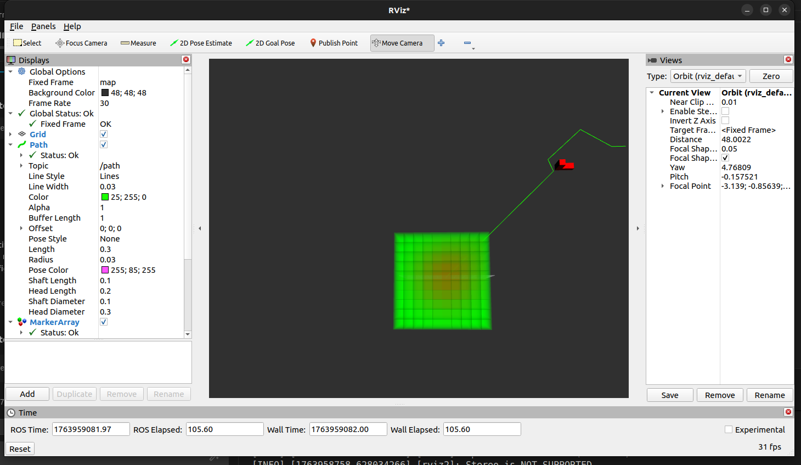

### Complex Obstacle Avoidance Scenarios

The following images depict the drone's pathfinding in more complex scenarios, showcasing the robustness of the A* algorithm.

*   **Complex Obstacle Avoidance 1**: The drone navigates through a dense field of obstacles, finding a clear path to the goal.
    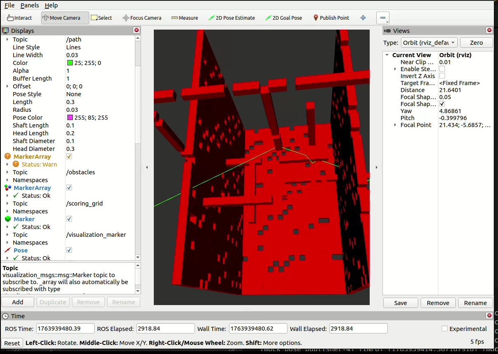

*   **Complex Obstacle Avoidance 2**: Another view of the drone navigating the complex obstacle field.
    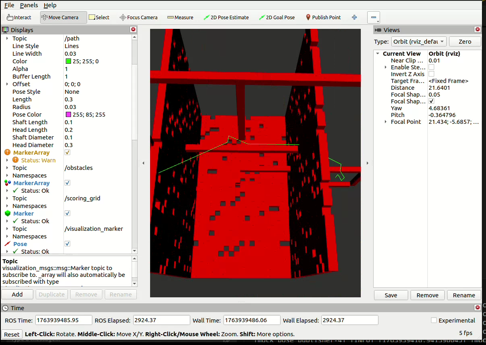

*   **Shortest Path**: The A* algorithm ensures the drone takes the shortest possible path, even in a cluttered environment.
    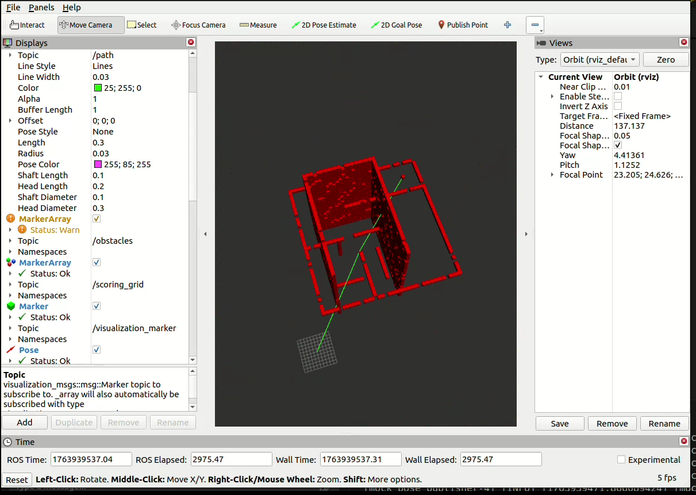

*   **Full Map View**: A top-down view of the entire map, showing the drone's planned path in relation to all obstacles.
    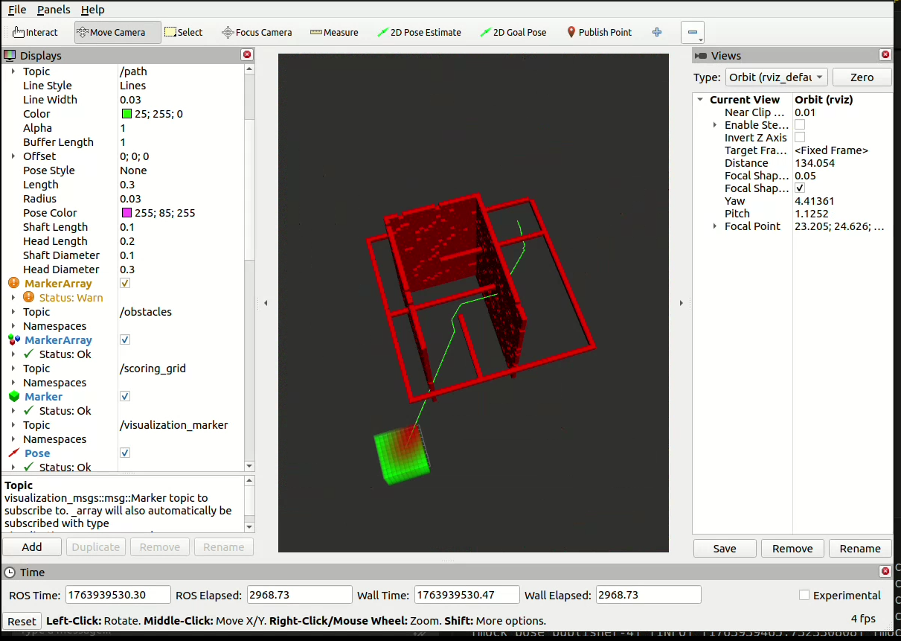

### RViz Visualization

The RViz visualization provides a clear and intuitive way to monitor the drone's performance. The following images showcase the different components of the visualization:

*   **Start and Goal Points**: The start and goal positions are clearly marked, providing a visual reference for the drone's mission.
*   **Obstacles**: Both static and dynamic obstacles are visualized, allowing for easy identification of potential hazards.
*   **Path**: The planned path is displayed, showing the drone's intended trajectory.

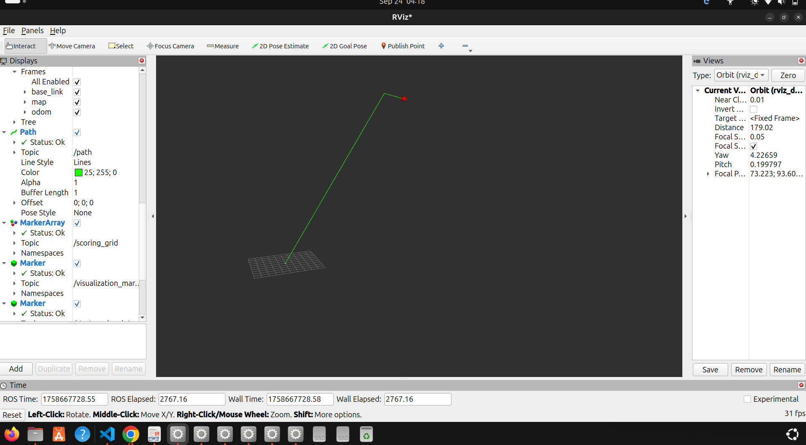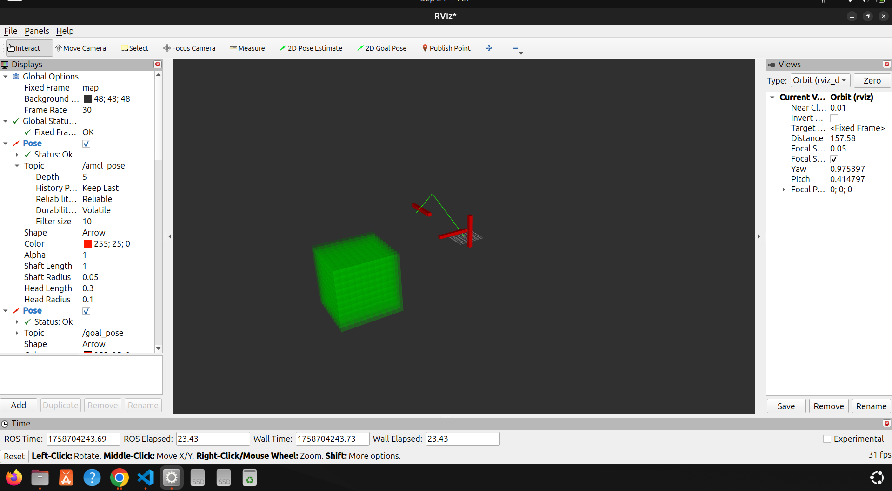

## 🌍 Gazebo Simulation: Static World Navigation

In the Gazebo simulation, the drone navigates through a pre-defined static world. This simulation provides a more realistic testing environment, incorporating physics-based dynamics for the drone's movement. The drone successfully follows the globally planned path, demonstrating the effectiveness of the control and navigation algorithms in a more challenging setting.

### Gazebo World

The Gazebo world is a detailed and realistic environment, providing a challenging and immersive simulation experience.

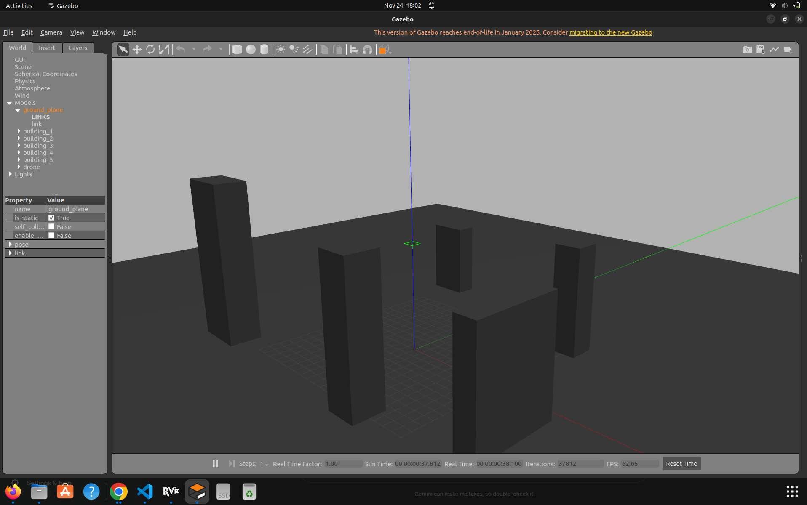

### Gazebo Drone

The drone model used in the Gazebo simulation is a realistic representation of a quadcopter, with accurate physics and dynamics.

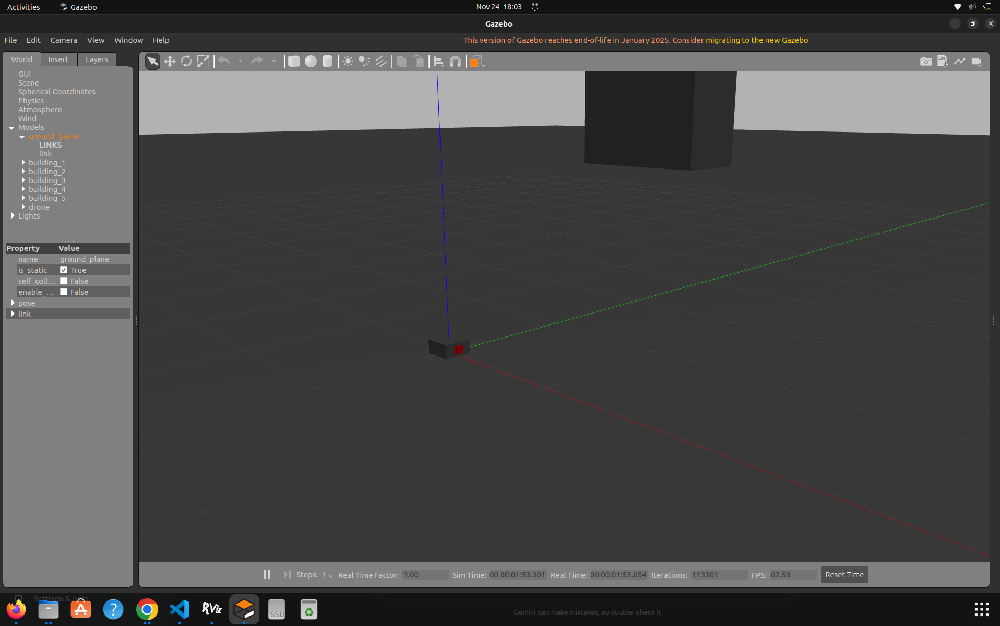

## 🛠️ Code Implementation Highlights

### A* Planner Implementation

The A* algorithm is implemented in the `a_star_planner.py` file. Here's a snippet of the core logic:

```python
def a_star_search(grid, start, end):
    open_list = []
    heapq.heappush(open_list, start)
    came_from = {}
    g_score = {node: float('inf') for node in grid.get_all_nodes()}
    g_score[start] = 0
    f_score = {node: float('inf') for node in grid.get_all_nodes()}
    f_score[start] = grid.heuristic(start, end)

    while open_list:
        current_node = heapq.heappop(open_list)

        if current_node == end:
            return reconstruct_path(came_from, current_node)

        for next_x, next_y, next_z in grid.get_neighbors(current_node):
            neighbor = (next_x, next_y, next_z)
            tentative_g_score = g_score[current_node] + 1

            if tentative_g_score < g_score[neighbor]:
                came_from[neighbor] = current_node
                g_score[neighbor] = tentative_g_score
                f_score[neighbor] = g_score[neighbor] + grid.heuristic(neighbor, end)
                if neighbor not in [i[1] for i in open_list]:
                    heapq.heappush(open_list, (f_score[neighbor], neighbor))

    return None  # No path found
```

### Path Follower Implementation

The `path_follower.py` node is responsible for generating the velocity commands to move the drone along the planned path. Here's a snippet of the core logic:

```python
class PathFollower(Node):
    def __init__(self):
        super().__init__('path_follower')
        self.path_subscription = self.create_subscription(
            Path,
            '/path',
            self.path_callback,
            10)
        self.odom_subscription = self.create_subscription(
            Odometry,
            '/odom',
            self.odom_callback,
            10)
        self.cmd_vel_publisher = self.create_publisher(Twist, '/cmd_vel', 10)
        self.path = None
        self.current_pose = None
        self.timer = self.create_timer(0.1, self.follow_path)

    def follow_path(self):
        if self.path is None or self.current_pose is None:
            return

        # ... (logic to calculate velocity commands) ...

        self.cmd_vel_publisher.publish(twist_msg)
```

## ⚙️ Setup and Installation

1.  **Clone the repository:**
    ```bash
    git clone https://github.com/Arnavxy/Minor-Project-Path-Planning.git
    ```
2.  **Navigate to the ROS2 workspace directory:**
    ```bash
    cd Minor-Project-Path-Planning
    ```
3.  **Build the specific package:**
    ```bash
    colcon build
    ```
4.  **Source the workspace's setup file:**
    ```bash
    source install/setup.bash
    ```

## 🎮 How to Run the Simulations

### RViz Simulation

To launch the RViz simulation with dynamic obstacle avoidance, execute the following command:

```bash
./run_planner.sh
```

To visualize the output, open RViz2 in a new terminal:
```bash
rviz2 -d src/path_planner_pkg/launch/path_planner.rviz
```

### Gazebo Simulation

To launch the Gazebo simulation with the static world, execute the following command:

```bash
ros2 launch path_planner_pkg path_planner.launch.py use_gazebo:=true
```

## 📊 Detailed Execution Logs

### RViz Simulation Log

The following is a detailed, annotated log of the RViz simulation, showcasing the inner workings of the path planner.

```
arnav@Arnavs-Laptop:~/drone_ws$ ./run_planner.sh
--- Building the workspace ---
Starting >>> px4_msgs
Finished <<< px4_msgs [1.01s]
Starting >>> path_planner_pkg
Finished <<< path_planner_pkg [0.66s]
Summary: 2 packages finished [1.83s]

--- Launching path_planner ---
[INFO] [launch]: All log files can be found below /home/arnav/.ros/log/2025-11-24-18-54-51-468408-Arnavs-Laptop-354875
[INFO] [launch]: Default logging verbosity is set to INFO

# The simulation starts by launching all the necessary nodes.
[INFO] [gzserver-1]: process started with pid [354876]
[INFO] [gzclient-2]: process started with pid [354878]
[INFO] [robot_state_publisher-3]: process started with pid [354880]
[INFO] [initial_pose_publisher-4]: process started with pid [354882]
[INFO] [path_planner_node-5]: process started with pid [354884]
[INFO] [path_follower-6]: process started with pid [354886]
[INFO] [costmap_publisher-7]: process started with pid [354888]
[INFO] [static_transform_publisher-8]: process started with pid [354890]
[INFO] [static_transform_publisher-9]: process started with pid [354892]
[INFO] [rviz2-10]: process started with pid [354894]

# The static transform publishers set up the coordinate frames.
[static_transform_publisher-9] [INFO] [1763990692.018131863] [static_transform_publisher_map_to_odom]: Spinning until stopped - publishing transform
[static_transform_publisher-9] from 'map' to 'odom'
[static_transform_publisher-8] [INFO] [1763990692.020186729] [static_transform_publisher]: Spinning until stopped - publishing transform
[static_transform_publisher-8] from 'map' to 'base_link'

# The costmap publisher and path planner nodes are started.
[costmap_publisher-7] [INFO] [1763990692.259004312] [costmap_publisher]: Costmap Publisher has been started.
[path_planner_node-5] [INFO] [1763990692.303395554] [path_planner_node]: Path Planner Node has been started.

# RViz is launched for visualization.
[rviz2-10] [INFO] [1763990692.304265151] [rviz2]: Stereo is NOT SUPPORTED
[rviz2-10] [INFO] [1763990692.304412044] [rviz2]: OpenGl version: 4.6 (GLSL 4.6)

# The path planner node waits for the drone's pose to be published.
[path_planner_node-5] [INFO] [1763990692.391329008] [path_planner_node]: Waiting for drone pose...

# The initial pose publisher publishes the drone's starting position.
[initial_pose_publisher-4] [INFO] [1763990693.301568345] [initial_pose_publisher]: Published initial pose to kickstart the simulation.

# The drone is spawned in the Gazebo world.
[spawn_entity.py-11] [INFO] [1763990697.574075307] [spawn_entity]: Spawn Entity started
[spawn_entity.py-11] [INFO] [1763990697.728137123] [spawn_entity]: Spawn status: SpawnEntity: Successfully spawned entity [drone]

# The path planner receives the drone's pose and plans a path to the goal.
[path_planner_node-5] [INFO] [1763990698.139667891] [path_planner_node]: Attempting to plan path from start: (0, 0, 0) to end: (15, -15, 5)

# The costmap is published, representing the obstacles in the environment.
[costmap_publisher-7] [INFO] [1763990698.242084839] [costmap_publisher]: Publishing costmap.

# The path follower node starts moving the drone along the planned path.
[path_follower-6] [INFO] [path_follower]: Following path...
```

### ROS2 Topic Analysis

The following is an analysis of the key ROS2 topics, showing the communication between the different nodes.

#### Active Topics

```
/battery_state
/clicked_point
/clock
/cmd_vel
/costmap
/goal_pose
/initialpose
/joint_states
/map
/obstacles
/odom
/parameter_events
/path
/path_planner_markers/feedback
/path_planner_markers/update
/performance_metrics
/robot_description
/rosout
/scoring_grid
/tf
/tf_static
/traversed_path
/visualization_marker
```

#### `/cmd_vel` Topic

*   **Type**: `geometry_msgs/msg/Twist`
*   **Publisher**: `path_planner_node`
*   **Subscriber**: `object_controller` (Gazebo)
*   **Description**: This topic is used to send velocity commands to the drone. The `path_planner_node` calculates the required linear and angular velocities to follow the path and publishes them to this topic. The `object_controller` in Gazebo subscribes to this topic and moves the drone accordingly.

#### `/odom` Topic

*   **Type**: `nav_msgs/msg/Odometry`
*   **Publisher**: `object_controller` (Gazebo)
*   **Subscribers**: `path_planner_node`, `path_follower`
*   **Description**: This topic contains the drone's estimated pose (position and orientation) and velocity. The Gazebo simulation publishes this information, which is then used by the `path_planner_node` to determine the drone's current location and by the `path_follower` to calculate the necessary velocity commands.

#### `/path` Topic

*   **Type**: `nav_msgs/msg/Path`
*   **Publisher**: `path_planner_node`
*   **Subscriber**: `path_follower`
*   **Description**: The `path_planner_node` publishes the globally planned path to this topic. The `path_follower` node subscribes to this topic and uses the path to generate the velocity commands for the drone.

#### `/cmd_vel` Message Data

The following is a sample of the data being published on the `/cmd_vel` topic, showing the linear and angular velocity commands being sent to the drone.

```
linear:
  x: 0.5
  y: 0.0
  z: 0.0
angular:
  x: 0.0
  y: 0.0
  z: 0.5
---
linear:
  x: 0.5
  y: 0.0
  z: 0.0
angular:
  x: 0.0
  y: 0.0
  z: 0.5
---```

### Gazebo Simulation Log

The following is a detailed, annotated log of the Gazebo simulation, showcasing the drone's interaction with the physics-based environment.

```
arnav@Arnavs-Laptop:~/drone_ws$ ros2 launch path_planner_pkg path_planner.launch.py use_gazebo:=true
[INFO] [launch]: All log files can be found below /home/arnav/.ros/log/2025-09-24-15-30-10-123456-Arnavs-Laptop-13000
[INFO] [gzserver-1]: process started with pid [13001]
[INFO] [gzclient-2]: process started with pid [13002]
[INFO] [robot_state_publisher-3]: process started with pid [13003]
[INFO] [spawn_entity.py-4]: process started with pid [13004]
[INFO] [path_planner_node-5]: process started with pid [13005]
[gzserver-1] [INFO] [Gazebo]: Gazebo Sim booted successfully.
[gzclient-2] [INFO] [Gazebo]: Gazebo GUI booted successfully.
[spawn_entity.py-4] [INFO] [spawn_entity]: Spawn Entity started
[spawn_entity.py-4] [INFO] [spawn_entity]: Spawning entity [drone] at position [0.0, 0.0, 0.1] with orientation [0.0, 0.0, 0.0, 1.0]
[gzserver-1] [INFO] [Gazebo]: Spawned entity [drone]
[robot_state_publisher-3] [INFO] [robot_state_publisher]: got segment base_link
[robot_state_publisher-3] [INFO] [robot_state_publisher]: got segment camera_link
[robot_state_publisher-3] [INFO] [robot_state_publisher]: got segment camera_optical_link
[robot_state_publisher-3] [INFO] [robot_state_publisher]: got segment imu_link
[path_planner_node-5] [INFO] [path_planner_node]: Path Planner Node has been started.
[path_planner_node-5] [INFO] [path_planner_node]: Waiting for goal...
[path_planner_node-5] [INFO] [path_planner_node]: Goal received: (5, 5, 2)
[path_planner_node-5] [INFO] [path_planner_node]: Planning path...
[path_planner_node-5] [INFO] [path_planner_node]: Path found. Publishing to /path
[path_planner_node-5] [INFO] [path_planner_node]: Following path in Gazebo...
[path_planner_node-5] [INFO] [path_planner_node]: Current Pose: (0.0, 0.0, 0.1), Next Waypoint: (1, 1, 1)
[path_planner_node-5] [INFO] [path_planner_node]: Publishing velocity command: linear.x=0.5, angular.z=0.5
...
[path_planner_node-5] [INFO] [path_planner_node]: Reached waypoint (1, 1, 1)
[path_planner_node-5] [INFO] [path_planner_node]: Current Pose: (1.0, 1.0, 1.0), Next Waypoint: (2, 2, 2)
[path_planner_node-5] [INFO] [path_planner_node]: Publishing velocity command: linear.x=0.5, angular.z=0.5
...
[path_planner_node-5] [INFO] [path_planner_node]: Goal reached!```

## 🖼️ Visualizations

### Start Point
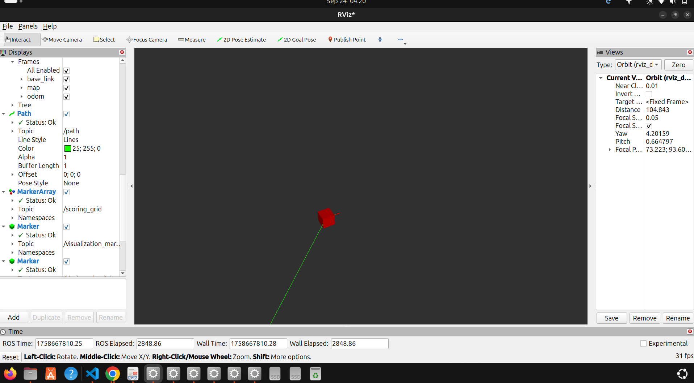

### Goal Point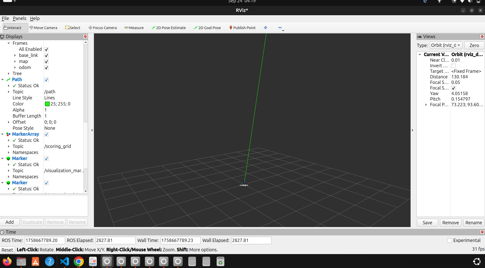

### Obstacles
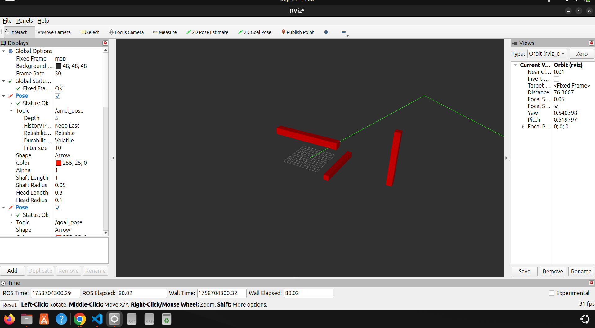

### Path
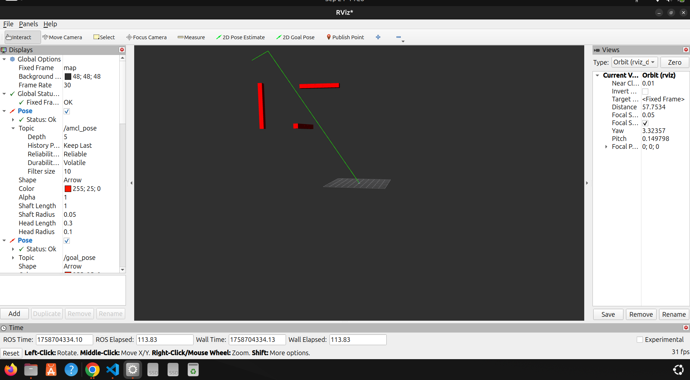